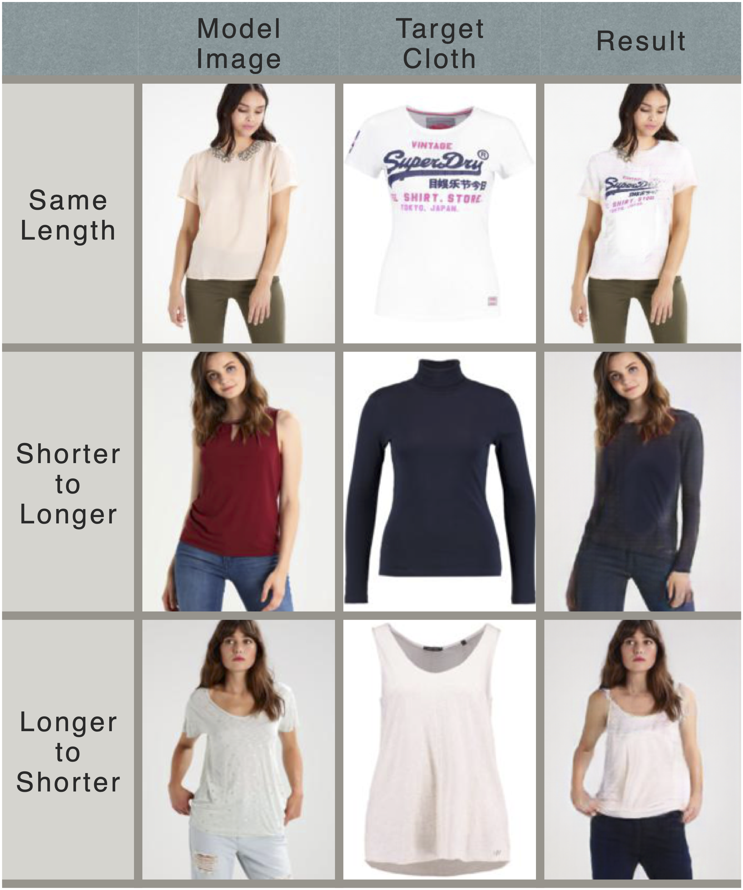
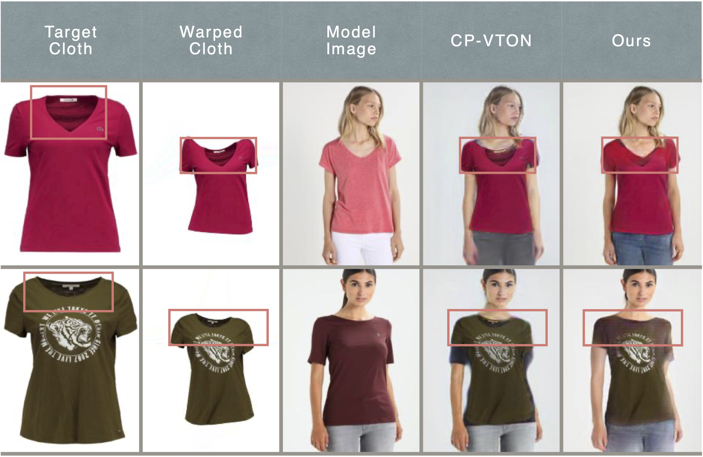
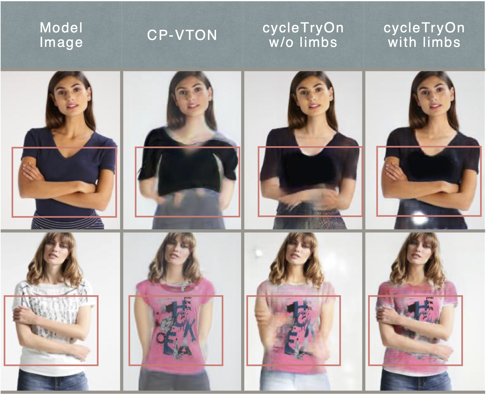
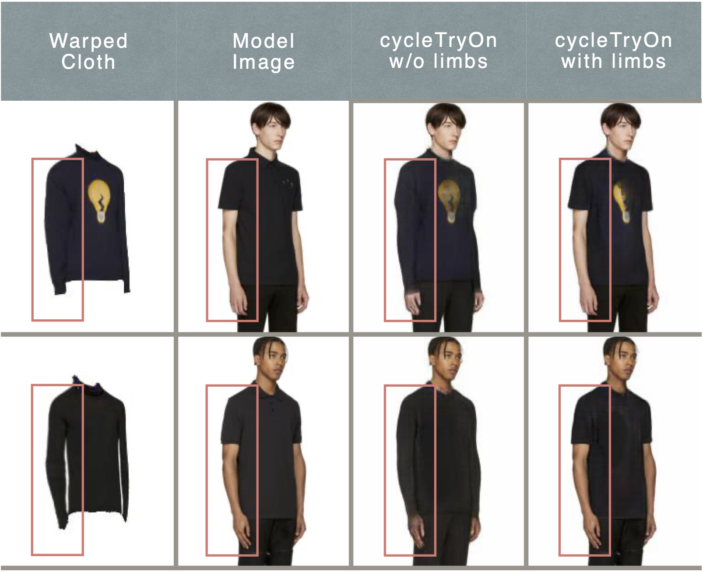
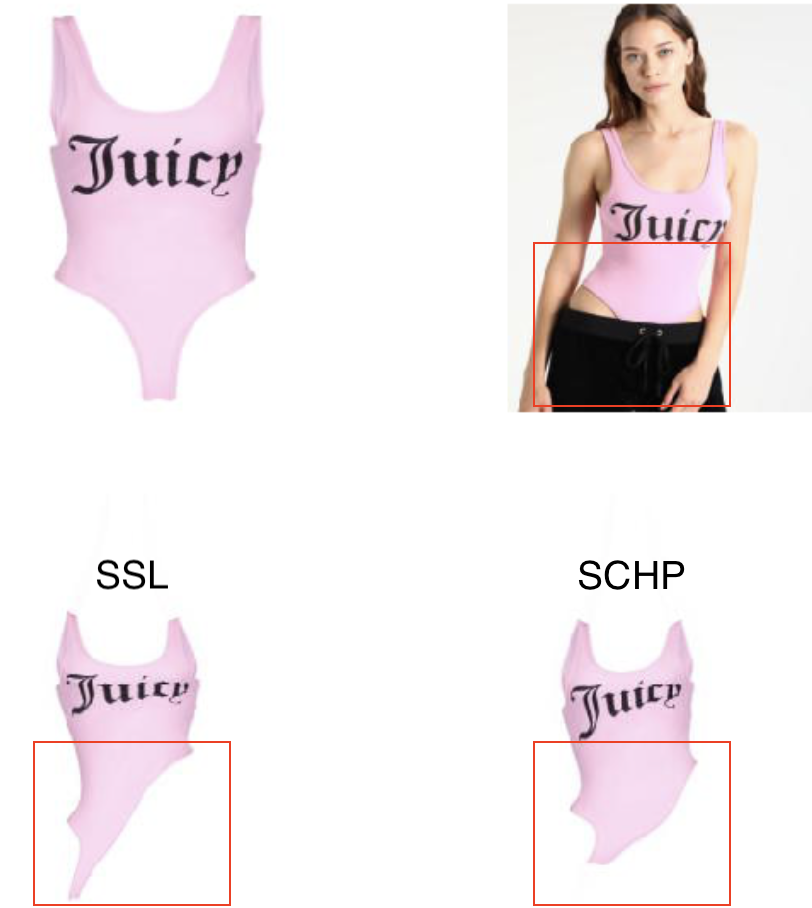

# AIAproject-FittingRoom
<div align="center">
 
 <p>Fig.1 Testing result for different types of Try-On task.</p>
</div>

- Virtual Try-On scheme base on cycleGAN.
- Top3 project in Taiwain AI Academy finals.(Technical Professionals Program)
- Use cycle consistency to improve unrealistic results either due to geometric matching or behavior of networks without inverse mapping.
- Code is developed and tested with pytorch==0.4.1, torchvision==0.2.1.
- _TOC_
   - [Dataset](#Dataset)
   - [Discussion](#Discussion)
     - [Geometric Matching Limitation](#Geometric-Matching-Limitation)
     - [Arms Missing Problem](#Arms-Missing-Problem)
       - [Joined Limbs Into Body Information](#Joined-Limbs-Into-Body-Information)
     - [Human Parser Influence](#Human-Parser-Influence)
   - [User Guide](#User-Guide)
     - [Training](#Training)
     - [Testing](#Testing)


## Dataset
- Base on [Toward Characteristic-Preserving Image-based Virtual Try-On Network](https://github.com/sergeywong/cp-vton)(CP-VTON) dataset.
- Use [Self Correction for Human Parsing](https://github.com/PeikeLi/Self-Correction-Human-Parsing) to achieve better parsing results.
- Add male model images extracted from [FashionGen dataset](https://fashion-gen.com) to extend real word usage.

## Discussion
- We reproduced [CP-VTON](https://github.com/sergeywong/cp-vton)'s Try-On Module by the implementation details their paper provided to make comparison with our cycleTryOn module in this section.

### Geometric Matching Limitation
- Although Geometric Matching Module(GMM) proposed by CP-VTON have proven its efficiency in aligning in-shop cloth with the person image, GMM does not have the ability to tell the difference between inner side of the cloth and the outer side, in other words GMM tends to force the WHOLE in-shop cloth images into the original cloth shape on person if the deformation grid is dense enough.
- **Cycle Consistency loss** and **Adversarial loss** were introduced to adjust this unrealistic result in this work. 
- As shown in Fig.2, the lining and tag of target cloth still exist in results of CP-VTON. Compared with CP-VTON, our cycleTryOn module have learned how to hide the inner part of the cloth and successfully generate the appropriate skin color of the person.

<div align="center">
 
 <p>Fig.2 In comparison of lining showing problem with CP-VTON's results, our cycleTryOn module successfully adjust this problem.</p>
</div>

### Arms Missing Problem
- For some rare pose in dataset, such as pose with folded arms, failure rate become extremely high in CP-VTON. In fact there is NO succese testing result in our reproduced CP-VTON model. 
- In our perspective, networks without inverse mapping is hard to learn in which case people's body information should be reserved. The best strategy of generator is paste the warped cloth on the right position when the data of folded arms pose is short.
- **Cycle Consistency** take a huge advantage to minimize this problem. It's simply because if people's body information is missing in final result, the load of generator to mapping back to original image becomes too heave, so the best strategy will be reserve those information at the first time.

<div align="center">
 
 <p>Fig.3 In comparison of arms missing problem with CP-VTON's results, our cycleTryOn module successfully reserve arms information. Even though our model haven't optimize to its best state, the tendency is still obvious.</p>
</div>

#### Joined Limbs Into Body Information
- After solve arms missing problem we joined limbs information into body information aims to refine the details.
- Provides limbs information to the network do have great limbs details in result as shown in Fig.4. But the presence of limbs information in input seems to strongly limit the cloth shape to the original one on model(see Fig.4).
- Although the usage of providing limbs information is restricted to same cloth type only, we still suggest training model by case for real word usage cause the refinement of details is too good.

<div align="center">
 
 <p>Fig.4 Comparison of limbs information been joined.</p>
 
 <p>Fig.5 Cases of the cloth type changed.</p>
</div>

### Human Parser Influence
- Since GMM takes the original cloth on person as ground truth by using human parser to crop the cloth out from model images, we consider the higher mIoU human parsing network can achieve the better GMM result would be.

<div align="center">
 
 <p>Fig.6 Higher IoU dose improve GMM result .</p>
</div>

## User Guide
- The framework of Try-On Module in this project refer to [Virtually Trying on New Clothing with Arbitrary Poses](https://www.english.com.tw/modules/newbb/viewtopic.php?post_id=928), but change the training strategy and pipeline for different purpose.
### Training
- example command, ```--uselimbs``` is an option for certain Try-On task, please see [Joined Limbs Into Body Information](#Joined-Limbs-Into-Body-Information).
```
python train_cycleTryOn.py --name 'gmm_train' --stage 'GMM' --save_count 5000 --shuffle
python train_cycleTryOn.py --name 'cycleTryOn_train' --stage 'cycleTryOn' --uselimbs
```
### Testing
```
python test_cycleTryOn.py --name 'gmm_test' --stage 'GMM' --datamode test --data_list 'test_pairs.txt' --checkpoint checkpoints/gmm_train/gmm_final.pth
python test_cycleTryOn.py --name 'cycleTryOn_test' --stage 'cycleTryOn' --uselimbs --datamode test --data_list 'test_pairs.txt' --checkpoint checkpoints/cycleTryOn_train/cycleTryOn_final.pth
```
