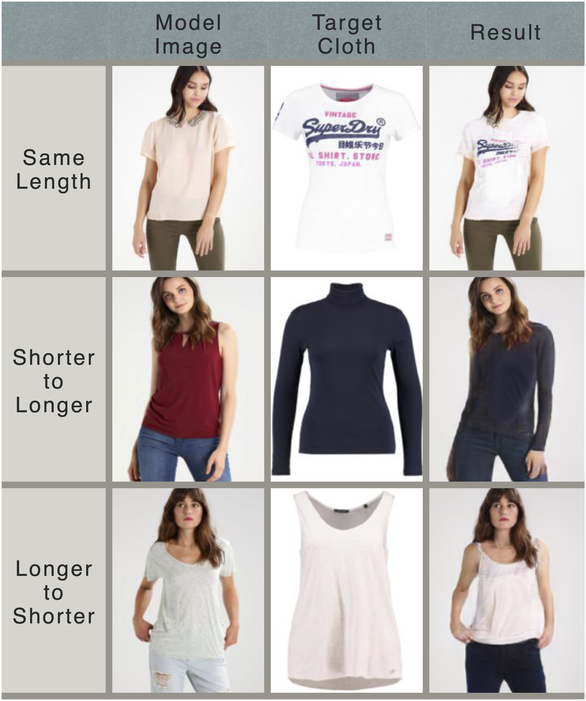
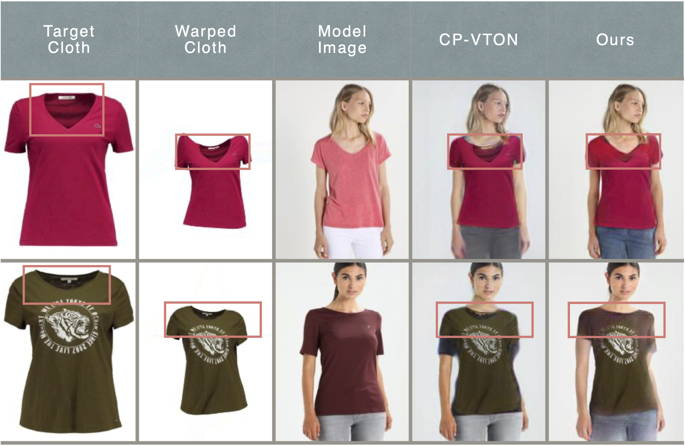
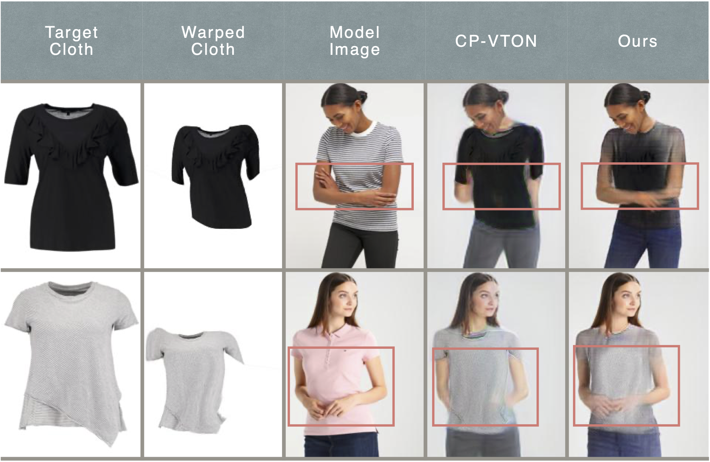
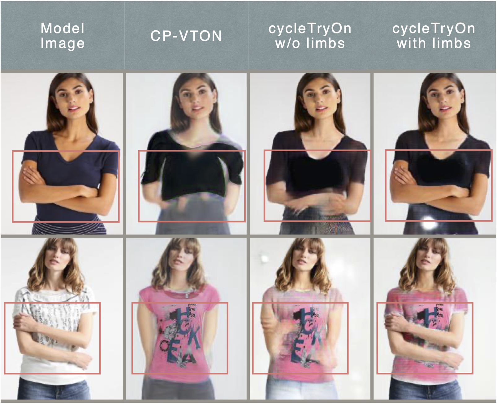
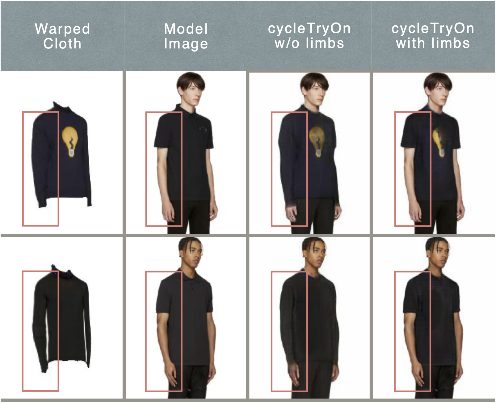
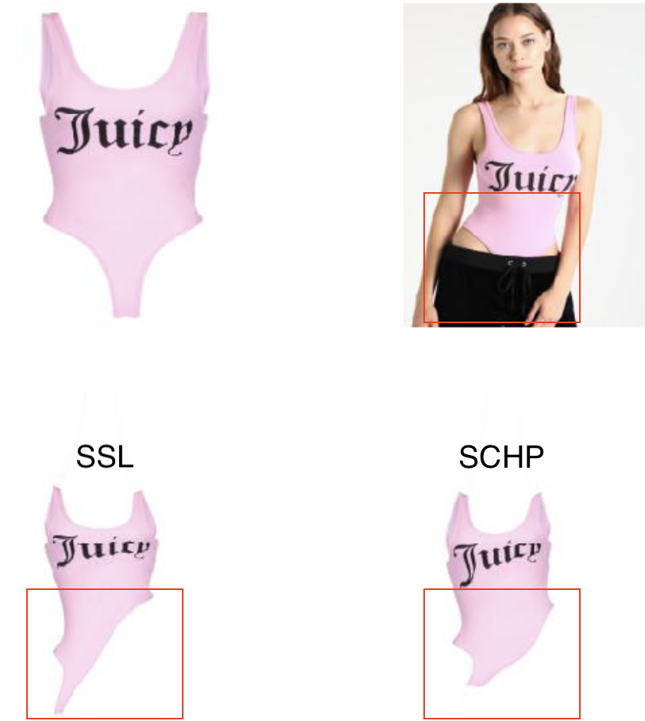

# AIAproject-FittingRoom
<div align="center">
 
 <p>Fig.1 Testing result for different types of Try-On task.</p>
</div>

- Virtual Try-On scheme based on cycleGAN.
- Top3 project in Taiwain AI Academy finals.(Technical Professionals Program)
- Utilize cycle consistency to improve unrealistic results caused by either geometric matching or the behavior of networks without inverse mapping.
- Code was developed and tested with pytorch==0.4.1, torchvision==0.2.1.
- _TOC_
   - [Dataset](#Dataset)
   - [Discussion](#Discussion)
     - [Geometric Matching Limitation](#Geometric-Matching-Limitation)
     - [Arms Missing Problem](#Arms-Missing-Problem)
       - [Joined Limbs Into Body Information](#Joined-Limbs-Into-Body-Information)
     - [Human Parser Influence](#Human-Parser-Influence)
   - [User Guide](#User-Guide)
     - [Training](#Training)
     - [Testing](#Testing)


## Dataset
- Based on the [Toward Characteristic-Preserving Image-based Virtual Try-On Network](https://github.com/sergeywong/cp-vton)(CP-VTON) dataset.
- Use [Self-Correction for Human Parsing](https://github.com/PeikeLi/Self-Correction-Human-Parsing) to achieve better parsing results.
- Add male model images from the [FashionGen dataset](https://fashion-gen.com) to support all genders for real-world use.


## Discussion
- We replicated [CP-VTON](https://github.com/sergeywong/cp-vton)'s Try-On Module by implementing the details described in their paper to compare it with our cycleTryOn module in this section.
### Geometric Matching Limitation
- Although the Geometric Matching Module (GMM), proposed by CP-VTON, has proven efficient at aligning in-shop clothes with human images, it lacks the ability to distinguish the inside and outside of clothes. To be more precise, GMM tends to force the WHOLE in-shop cloth image into the original clothing shape on the person if the deformation grid is dense enough.

- **Cycle Consistency Loss** and **Adversarial Loss** are introduced in this work to address this kind of unrealistic problem.

- As shown in Fig. 2, the lining and tag of the target clothes still appear in the results of CP-VTON. Compared to CP-VTON, our cycleTryOn module has learned to hide the inner parts of clothes and successfully generate the appropriate skin colors for people.

<div align="center">
 
 <p>Fig.2 In contrary to the lining showing problem with CP-VTON's, our cycleTryOn module has successfully adjusted this problem.</p>
</div>

### Arms Missing Problem
- For some rare poses in dataset, pose with folded arms for example, failure rate become extremely high in CP-VTON. Substantially, there has NO success testing result been found in our facsimile of CP-VTON module. 

- From our perspective, networks without inverse mapping are hard to learn, in which case, people’s body information should be reserved. The best strategy for a single GAN is to paste warped clothes into the correct positions when the data for the folded-arm pose is short.

- *Cycle Consistency* provides a significant advantage in minimizing this problem. It’s simply because if people’s body information is missing in the final results, the generator will become heavily loaded when it maps back to the original images. Therefore, the best strategy will be to reserve that information at first.

<div align="center">
 
 <p>Fig.3 In comparison of arms missing problem with CP-VTON's results, our cycleTryOn module has successfully reserved arms information. Even though our model haven't optimize to its best state, the tendency is still obvious.</p>
</div>

#### Joined Limbs Into Body Information
- After resolving the missing arms issue, we combine the limb and body information to refine the details.

- Providing limb information to the network results in detailed limb information, as shown in Fig. 4. However, the presence of limb information in the input seems to strongly limit the clothing shape to the original one in the model (see Fig. 4).

- Although providing limb information restricted usage to a single clothing type, we still suggest training the model by case for real-world use, given the model's potential for detailed refinement.

<div align="center">
 
 <p>Fig.4 Comparison of limbs information been joined.</p>
 
 <p>Fig.5 Cases of the clothing type changed.</p>
</div>

### Human Parser Influence
- Since GMM uses the original clothing on a person as ground truth by using a human parser to crop the clothing from a person's image, we hypothesize that a higher mIoU human parsing network can achieve better GMM results.

<div align="center">
 
 <p>Fig.6 Higher IoU dose improve GMM result .</p>
</div>

## User Guide
- The framework of this FittingRoom try-on cycleGAN refers to  [Virtually Trying on New Clothing with Arbitrary Poses](https://www.english.com.tw/modules/newbb/viewtopic.php?post_id=928), but changes the training strategy and data pipeline for a better quality.

### Training
- example command, ```--uselimbs``` is an option for certain Try-On task, please see [Joined Limbs Into Body Information](#Joined-Limbs-Into-Body-Information).
```
python train_cycleTryOn.py --name 'gmm_train' --stage 'GMM' --save_count 5000 --shuffle
python train_cycleTryOn.py --name 'cycleTryOn_train' --stage 'cycleTryOn' --uselimbs
```
### Testing
```
python test_cycleTryOn.py --name 'gmm_test' --stage 'GMM' --datamode test --data_list 'test_pairs.txt' --checkpoint checkpoints/gmm_train/gmm_final.pth
python test_cycleTryOn.py --name 'cycleTryOn_test' --stage 'cycleTryOn' --uselimbs --datamode test --data_list 'test_pairs.txt' --checkpoint checkpoints/cycleTryOn_train/cycleTryOn_final.pth
```
## Reference
- Wang, Bochao, et al. "Toward characteristic-preserving image-based virtual try-on network." Proceedings of the European Conference on Computer Vision (ECCV). 2018.
- Zheng, Na, et al. "Virtually trying on new clothing with arbitrary poses." Proceedings of the 27th ACM International Conference on Multimedia. 2019.
